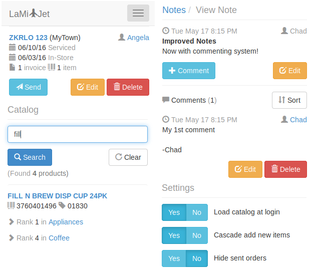

# LaMi-Jet v1.0.0

A mobile web application that supplies merchandisers with electronic catalog search and mobile ordering capabilities. 

This project was initially scaffolded with the [Angular Full-Stack Generator](https://github.com/DaftMonk/generator-angular-fullstack) version 3.5.0 and subsequently extended and heavily customized to suit design requirements.

Contact [me](mailto:chad.r.milburn@gmail.com) for credentials and login to the demo [here](https://lamijet.herokuapp.com).
